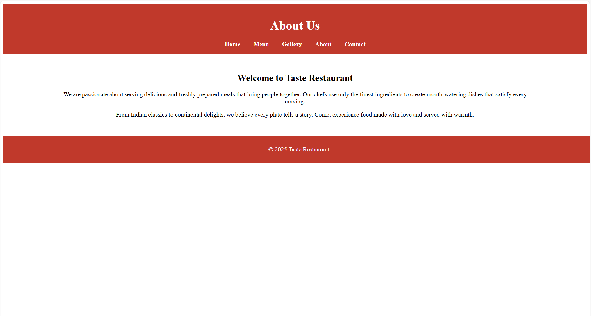
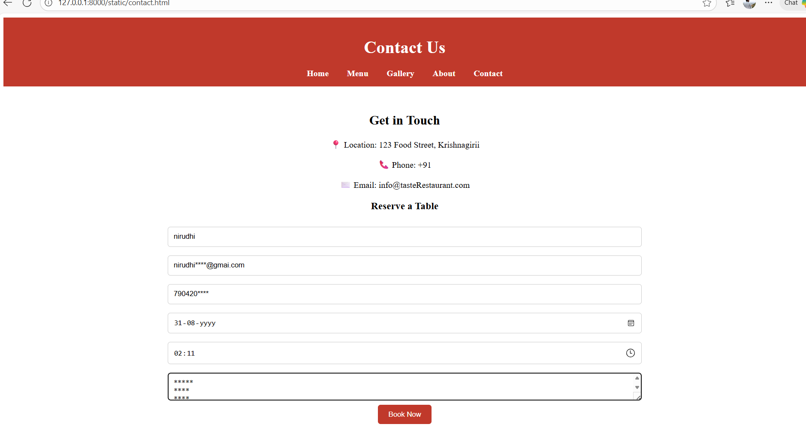
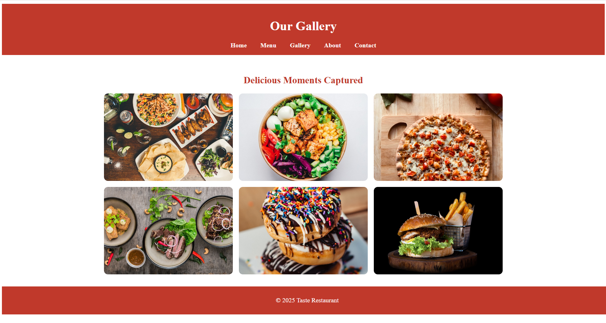
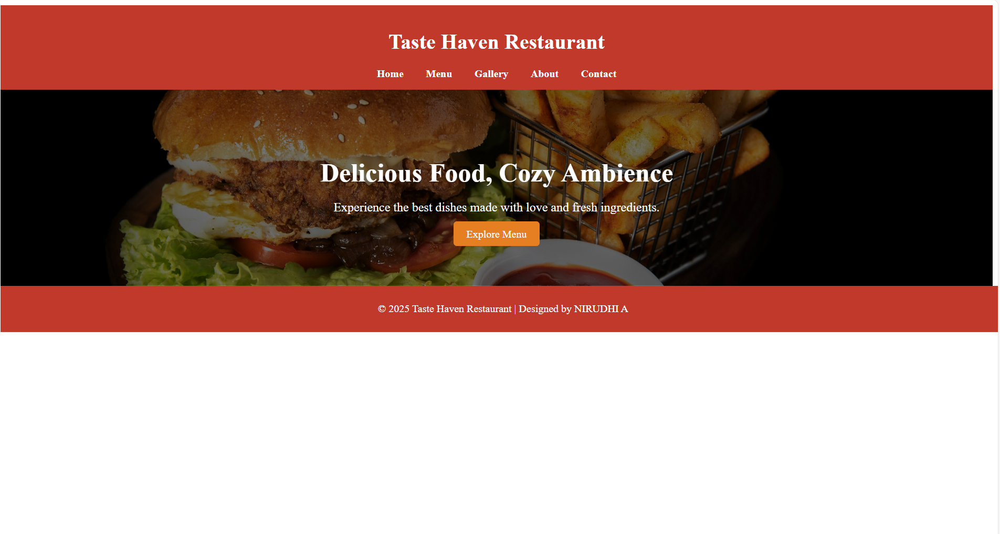
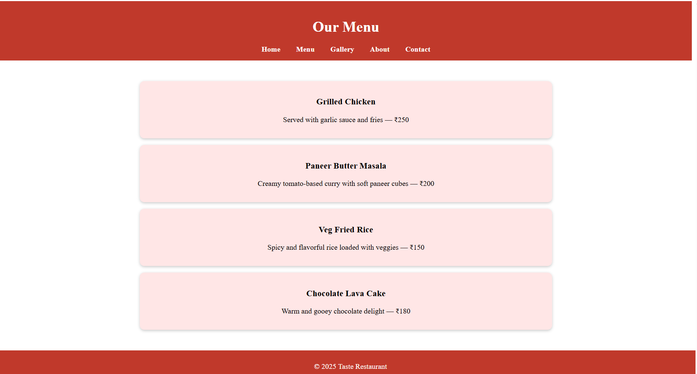

# Ex.07 Restuarant Website
## Date:1.11.2025

## AIM:
To develop a static Resturant website to display the menu and services provided by the resturant.

## DESIGN STEPS:

### Step 1:
Requirement collection.

### Step 2:
Creating the layout using HTML and CSS.

### Step 3:
Updating the sample content.

### Step 4:
Choose the appropriate style and color scheme.

### Step 5:
Validate the layout in various browsers.

### Step 6:
Validate the HTML code.

### Step 7:
Publish the website in the given URL.

## PROGRAM:
```
#about.html

<!DOCTYPE html>
<html lang="en">
<head>
  <meta charset="UTF-8">
  <meta name="viewport" content="width=device-width, initial-scale=1.0">
  <title>About - Taste Restaurant </title>
  <link rel="stylesheet" href="style.css">
</head>
<body>
  <header>
    <h1>About Us</h1>
    <nav>
      <ul>
        <li><a href="index.html">Home</a></li>
        <li><a href="menu.html">Menu</a></li>
        <li><a href="gallery.html">Gallery</a></li>
        <li><a href="about.html">About</a></li>
        <li><a href="contact.html">Contact</a></li>
      </ul>
    </nav>
  </header>

  <section class="about">
    <h2>Welcome to Taste Restaurant</h2>
    <p>We are passionate about serving delicious and freshly prepared meals that bring people together. 
    Our chefs use only the finest ingredients to create mouth-watering dishes that satisfy every craving.</p>

    <p>From Indian classics to continental delights, we believe every plate tells a story. 
    Come, experience food made with love and served with warmth.</p>
  </section>

  <footer>
    <p>© 2025 Taste Restaurant</p>
  </footer>
</body>
</html>

#contact.html

<!DOCTYPE html>
<html lang="en">
<head>
  <meta charset="UTF-8">
  <meta name="viewport" content="width=device-width, initial-scale=1.0">
  <title>Contact - Taste Restaurant</title>
  <link rel="stylesheet" href="style.css">
</head>
<body>
  <header>
    <h1>Contact Us</h1>
    <nav>
      <ul>
        <li><a href="index.html">Home</a></li>
        <li><a href="menu.html">Menu</a></li>
        <li><a href="gallery.html">Gallery</a></li>
        <li><a href="about.html">About</a></li>
        <li><a href="contact.html">Contact</a></li>
      </ul>
    </nav>
  </header>

  <section class="contact">
    <h2>Get in Touch</h2>
    <p>📍 Location: 123 Food Street, Krishnagirii</p>
    <p>📞 Phone: +91 </p>
    <p>✉️ Email: info@tasteRestaurant.com</p>

    <h3>Reserve a Table</h3>
    <form class="reservation-form">
      <input type="text" placeholder="Your Name" required>
      <input type="email" placeholder="Email Address" required>
      <input type="tel" placeholder="Phone Number" required>
      <input type="date" required>
      <input type="time" required>
      <textarea placeholder="Special Requests"></textarea>
      <button type="submit">Book Now</button>
    </form>
  </section>

  <footer>
    <p>© 2025 Taste Restaurant</p>
  </footer>
</body>
</html>

#gallery.html

<!DOCTYPE html>
<html lang="en">
<head>
  <meta charset="UTF-8">
  <meta name="viewport" content="width=device-width, initial-scale=1.0">
  <title>Gallery - Taste Restaurant</title>
  <link rel="stylesheet" href="style.css">
</head>
<body>
  <header>
    <h1>Our Gallery</h1>
    <nav>
      <ul>
        <li><a href="index.html">Home</a></li>
        <li><a href="menu.html">Menu</a></li>
        <li><a href="gallery.html">Gallery</a></li>
        <li><a href="about.html">About</a></li>
        <li><a href="contact.html">Contact</a></li>
      </ul>
    </nav>
  </header>

  <section class="gallery">
    <h2>Delicious Moments Captured</h2>
    <div class="gallery-grid">
      
      
      
      
      
      
    </div>
  </section>

  <footer>
    <p>© 2025 Taste Restaurant</p>
  </footer>
</body>
</html>

#index.html

<!DOCTYPE html>
<html lang="en">
<head>
  <meta charset="UTF-8">
  <meta name="viewport" content="width=device-width, initial-scale=1.0">
  <title>Taste Restaurant</title>
  <link rel="stylesheet" href="style.css">
</head>
<body>
  <header>
    <h1>Taste Haven Restaurant</h1>
    <nav>
      <ul>
        <li><a href="index.html">Home</a></li>
        <li><a href="menu.html">Menu</a></li>
        <li><a href="gallery.html">Gallery</a></li>
        <li><a href="about.html">About</a></li>
        <li><a href="contact.html">Contact</a></li>
      </ul>
    </nav>
  </header>

  <section class="hero">
    <h2>Delicious Food, Cozy Ambience</h2>
    <p>Experience the best dishes made with love and fresh ingredients.</p>
    <a href="menu.html" class="btn">Explore Menu</a>
  </section>

  <footer>
    <p>© 2025 Taste Haven Restaurant | Designed by NIRUDHI A</p>
  </footer>
</body>
</html>

#menu.html

<!DOCTYPE html>
<html lang="en">
<head>
  <meta charset="UTF-8">
  <meta name="viewport" content="width=device-width, initial-scale=1.0">
  <title>Menu - Taste Restaurant</title>
  <link rel="stylesheet" href="style.css">
</head>
<body>
  <header>
    <h1>Our Menu</h1>
    <nav>
      <ul>
        <li><a href="index.html">Home</a></li>
        <li><a href="menu.html">Menu</a></li>
        <li><a href="gallery.html">Gallery</a></li>
        <li><a href="about.html">About</a></li>
        <li><a href="contact.html">Contact</a></li>
      </ul>
    </nav>
  </header>

  <section class="menu">
    <div class="menu-item">
      <h3>Grilled Chicken</h3>
      <p>Served with garlic sauce and fries — ₹250</p>
    </div>
    <div class="menu-item">
      <h3>Paneer Butter Masala</h3>
      <p>Creamy tomato-based curry with soft paneer cubes — ₹200</p>
    </div>
    <div class="menu-item">
      <h3>Veg Fried Rice</h3>
      <p>Spicy and flavorful rice loaded with veggies — ₹150</p>
    </div>
    <div class="menu-item">
      <h3>Chocolate Lava Cake</h3>
      <p>Warm and gooey chocolate delight — ₹180</p>
    </div>
  </section>

  <footer>
    <p>© 2025 Taste Restaurant</p>
  </footer>
</body>
</html>

```

## OUTPUT:





## RESULT:
The program for designing software company website using HTML and CSS is completed successfully.
